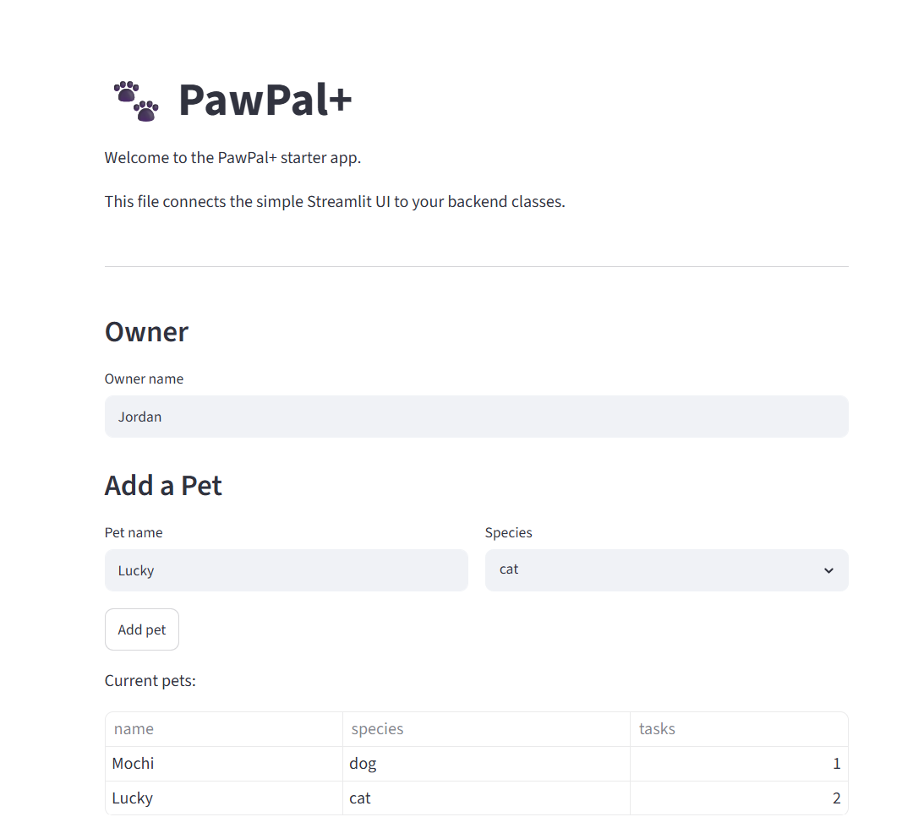
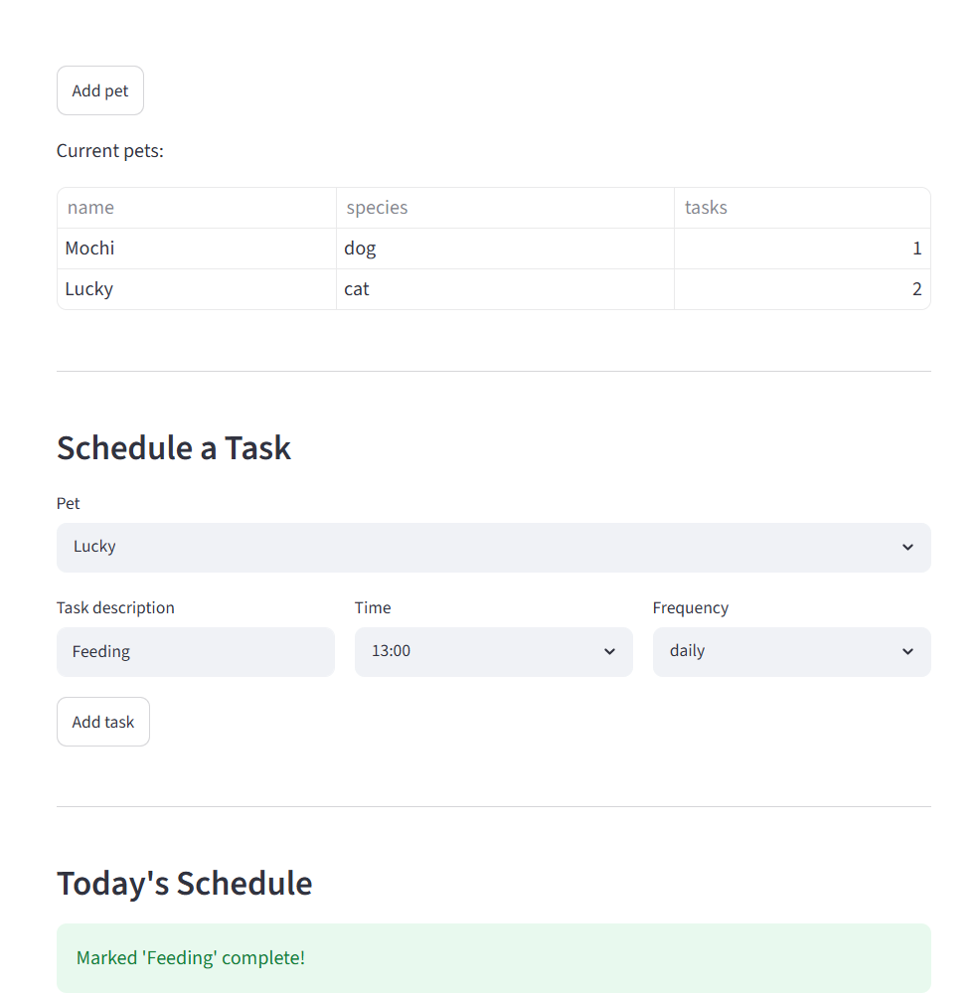
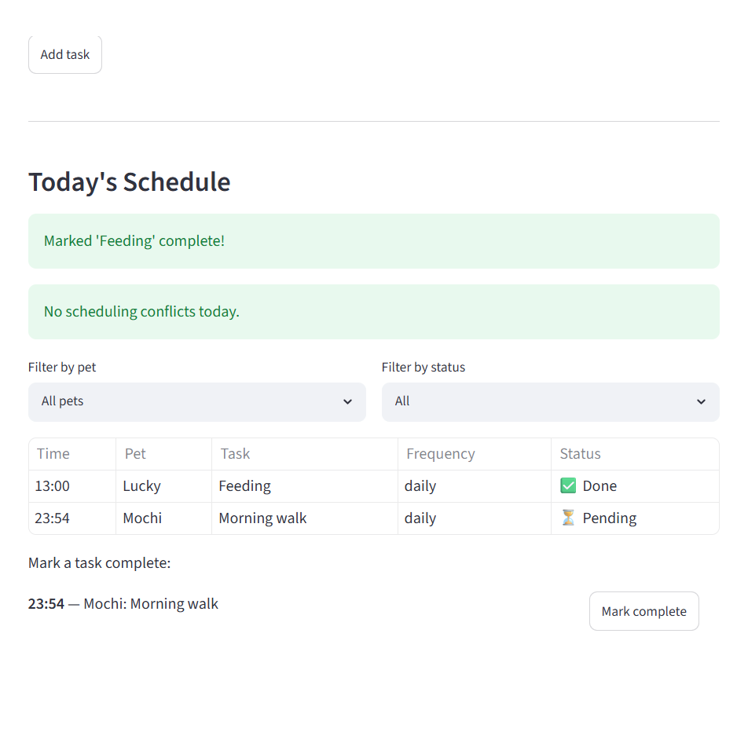

# PawPal+ (Module 2 Project)

You are building **PawPal+**, a Streamlit app that helps a pet owner plan care tasks for their pet.

## Scenario

A busy pet owner needs help staying consistent with pet care. They want an assistant that can:

- Track pet care tasks (walks, feeding, meds, enrichment, grooming, etc.)
- Consider constraints (time available, priority, owner preferences)
- Produce a daily plan and explain why it chose that plan

Your job is to design the system first (UML), then implement the logic in Python, then connect it to the Streamlit UI.

## What you will build

Your final app should:

- Let a user enter basic owner + pet info
- Let a user add/edit tasks (duration + priority at minimum)
- Generate a daily schedule/plan based on constraints and priorities
- Display the plan clearly (and ideally explain the reasoning)
- Include tests for the most important scheduling behaviors

## Getting started

### Setup

```bash
python -m venv .venv
source .venv/bin/activate  # Windows: .venv\Scripts\activate
pip install -r requirements.txt
```
### Features

The PawPal+ app allows users to:
- Enter and update the owner's name.
- Add multiple pets and view them in the app.
- Schedule pet care tasks by entering a description, selecting a time, and choosing a task frequency (daily, weekly, or once).
- View a daily schedule that is automatically sorted by time.
- Filter the schedule by pet or completion status.
- Mark tasks as completed.
- View warnings when scheduling conflicts are detected.


### Suggested workflow

1. Read the scenario carefully and identify requirements and edge cases.
2. Draft a UML diagram (classes, attributes, methods, relationships).
3. Convert UML into Python class stubs (no logic yet).
4. Implement scheduling logic in small increments.
5. Add tests to verify key behaviors.
6. Connect your logic to the Streamlit UI in `app.py`.
7. Refine UML so it matches what you actually built.


## 🖥️ Sample Output

Owner: Jordan
Pets:
- Mochi (dog)
- Whiskers (cat)
Today's Schedule:
07:30 - Feed breakfast (daily)
08:00 - Morning walk (daily)
18:00 - Dinner (daily)


## 🧪 Testing PawPal+

Run the test suite: 

```bash
python -m pytest
```
**What the tests cover:**
- Task completion behavior
- Adding tasks to a pet
- Sorting tasks by scheduled time
- Filtering tasts by pet and completion status
- Recurring task creation (daily and weekly)
- Conflict detection for overlapping tasks

**Confidence:** ★★★★☆ (4/5) — checks the main scheduling features and behavior; still additional edge cases that could be tested, such as tasks crossing midnight, more complex recurring schedules, and larger numbers of pets and tasks

Sample test output:

```
PS C:\Users\srikr\OneDrive\Desktop\.vscode\CodePath\ai110-module2show-pawpal-starter> python -m pytest
========================================================================================= test session starts ==========================================================================================
platform win32 -- Python 3.13.0, pytest-9.1.0, pluggy-1.6.0
rootdir: C:\Users\srikr\OneDrive\Desktop\.vscode\CodePath\ai110-module2show-pawpal-starter
plugins: anyio-4.13.0
collected 19 items                                                                                                                                                                                      

tests\test_pawpal.py ...................                                                                                                                                                          [100%]

========================================================================================== 19 passed in 0.08s ==========================================================================================                                                                        python -m pytest:\Users\srikr\OneDrive\Desktop\.vscode\CodePath\ai110-module2show-pawpal-starter> 
====================================== test session starts ======================================
platform win32 -- Python 3.13.0, pytest-9.1.0, pluggy-1.6.0
rootdir: C:\Users\srikr\OneDrive\Desktop\.vscode\CodePath\ai110-module2show-pawpal-starter
plugins: anyio-4.13.0
collected 19 items                                                                               

tests\test_pawpal.py ...................                                                   [100%]

====================================== 19 passed in 0.09s =======================================
```

## 📐 Smarter Scheduling

| Feature | Method(s) | Notes |
|---------|-----------|-------|
| Task sorting | 'Scheduler.sort_by_time()' | Sorts tasks in chronological order based on their scheduled time. |
| Filtering | 'Scheduler.filter_tasks()' | Filters tasks by pet name or completion status (completed or pending). |
| Conflict handling | 'Scheduler.find_conflicts()', 'Scheduler.describe_conflicts()' | Detects overlapping task times and displays warning messages instead of interrupting the program. |
| Recurring tasks | 'Task.next_due_date()', 'Task.next_occurence()', 'Scheduler.complete_task()' | Automatically creates the next occurence of daily and weekly tasks after they are completed. |

## 📸 Demo Walkthrough

Describe your app in numbered steps so a reader can follow along without watching a video:

1. Enter the owner's name and add one or more pets by including each pet's name and species.
2. Select one of the pets and create pet care tasks by entering a description, choosing a scheduled time, and selecting whether the task is one-time, daily, or weekly task.
3. View the daily schedule since the scheduler will automatically sort tasks in chronological order and displays them in a table that includes the task time, pet name, task description, frequency, and completion status.
4. Use the filter options to display tasks for a specific pet or to view only completed or pending tasks.
5. If two tasks overlap, the scheduler displays warning messages to notify the user of scheduling conflicts. Tasks for the same pet are shown as errors, while conflicts between different pets are shown as warnings.
6. Mark pending tasks as complete using the **Mark complete** button. If the task is recurring (daily or weekly), the scheduler automatically creates the next occurrence so it will appear on that date.

**Screenshot or video** *(optional)*: 



